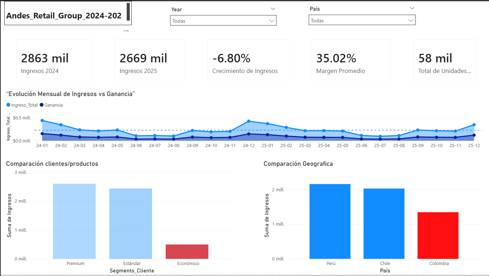
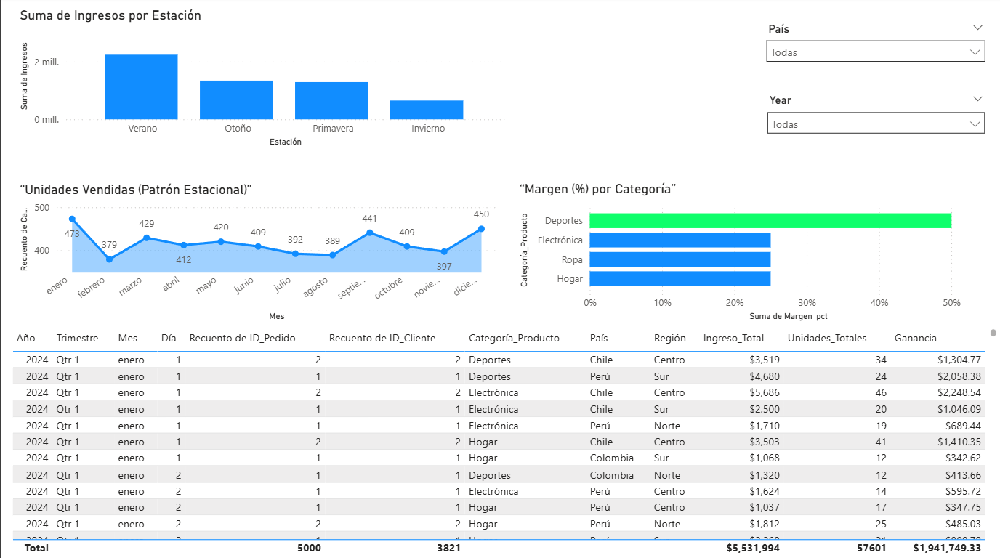

📊 Retail Dashboard 2024–2025 — Power BI
Dashboard interactivo desarrollado en Power BI para analizar el desempeño comercial entre 2024 y 2025. Incluye KPIs clave, análisis de crecimiento, comparaciones geográficas, métricas por cliente y producto, y una narrativa ejecutiva basada en SCQA.
El proyecto fue optimizado tras revisión técnica para asegurar precisión en métricas, tipos de datos y visualizaciones alineadas a estándares profesionales.

🚀 Objetivo del Proyecto
Proveer una vista clara y accionable del desempeño comercial, identificando variaciones año contra año, oportunidades de mejora y patrones relevantes en ingresos, clientes y productos.

🧩 Contenido del Dashboard
1. KPIs principales
Ingresos totales

Crecimiento de ingresos (fórmula corregida)

Precio unitario promedio

Clientes únicos

2. Análisis comparativos
Ingresos por región (visualización corregida a barras)

Top clientes y productos basados en métricas de negocio

Variación 2024 vs 2025

3. Vista Detallada
Segmentadores visibles

Comparación Estación vs Ingresos

Conteo único de clientes correctamente implementado

🧠 Narrativa Ejecutiva (SCQA)
Situación: La empresa busca entender el desempeño comercial entre 2024 y 2025.
Complicación: Se detectan variaciones en ingresos y comportamiento desigual entre regiones y productos.
Pregunta: ¿Qué factores explican el cambio y dónde están las oportunidades?
Respuesta: El dashboard revela caídas puntuales en ingresos, diferencias por región y oportunidades de optimización en productos y clientes clave.

🛠️ Tecnologías Utilizadas
Power BI (modelado, DAX, visualizaciones)

Excel / CSV (fuente de datos)

DAX para KPIs, medidas y cálculos financieros
